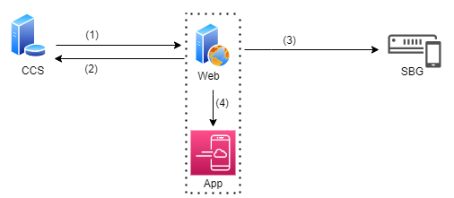

# 📔 HƯỚNG DẪN SỬ DỤNG HỆ THỐNG WEBSITE HỖ TRỢ ĐẠI LÝ BKAV

## Khái niệm:

 Mô hình hệ thống **Quản lý đại lý Bkav**

<figure><figcaption></figcaption></figure>

* **CCS:** hệ thống duyệt đơn đặt hàng nhận từ Web, quản lý đơn hàng, đốc thúc công nợ, thực hiện thanh toán và dịch vụ giao nhận cho các sản phẩm của Bkav
* **Web:** hệ thống quản lý đại lý, tạo đơn đặt hàng, theo dõi đơn hàng, sản phẩm, công nợ
* **App:** ứng dụng trên mobile cho phép tạo đơn đặt hàng, theo dõi đơn hàng, sản phẩm, công nợ
* **SBG:** hệ thống nhận thông tin từ Web và gửi tin nhắn SMS cho người dùng

 **Danh sách sản phẩm phát triển hệ thống kênh đại lý:**

* Dịch vụ chữ ký số Bkav CA (CA)
* Dịch vụ hóa đơn điện tử Bkav eHoadon (eHoadon)
* Chứng từ điện tử Bkav eChungtu (eChungtu)
* Hợp đồng điện tử Bkav eContract (eContract)
* Phần mềm bảo hiểm xã hội điện tử Bkav IVAN (IVAN)
* Dịch vụ kê khai thuế điện tử Bkav TVAN (TVAN)
* Phần mềm diệt virus Bkav Pro (Pro)
* Nhà thông minh Bkav SmartHome (SmartHome)
* Điện thoại thông minh BPhone (BPhone)
* Các dịch vụ, sản phẩm và thiết bị An ninh mạng gồm có Network Inspector, Bkav Antispam GW, Bkav Gateway Scan, Bkav Web Scan…
* Phần mềm Chính phủ điện tử gồm có Bkav ePortal, Bkav Bmail, Bkav eOffice, Bkav eGate

<mark style="color:red;">**Trong quá trình sử dụng hệ thống Đại lý Bkav, quý Đại lý/Kỹ thuật viên cần hỗ trợ vui lòng liên hệ số Hotline: 0931 793 596.**</mark>
