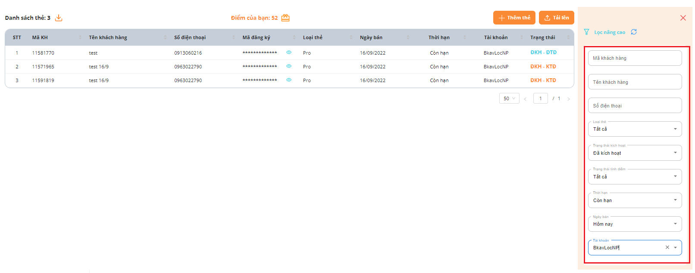

# 🤝 Chia sẻ

## Chia sẻ dữ liệu:&#x20;

* Cho phép Người tạo tài khoản của Bạn được quyền xem dữ liệu.

<figure><figcaption></figcaption></figure>

## Chọn dữ liệu muốn chia sẻ:

<figure><figcaption></figcaption></figure>

## Xem dữ liệu được tài khoản khác chia sẻ:

* Bước 1:

<figure><figcaption></figcaption></figure>

* Bước 2:

<figure><figcaption></figcaption></figure>
