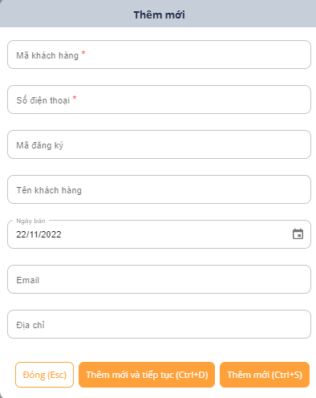
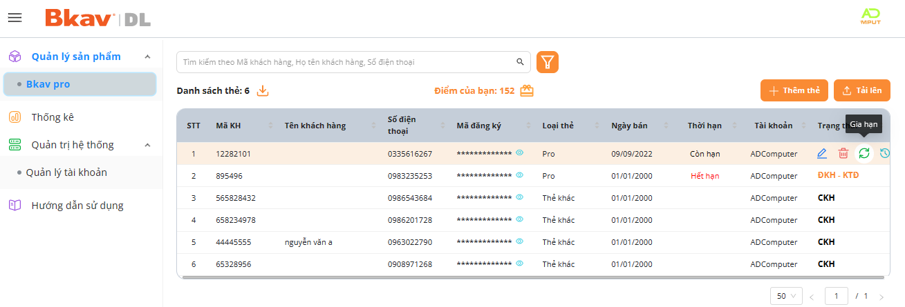
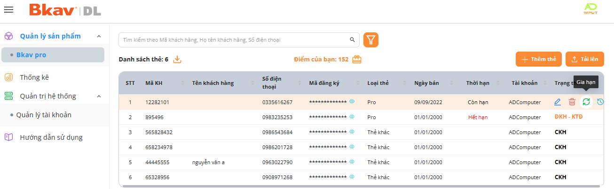
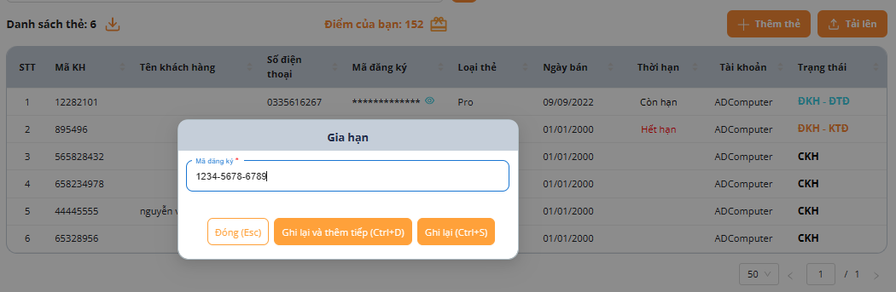
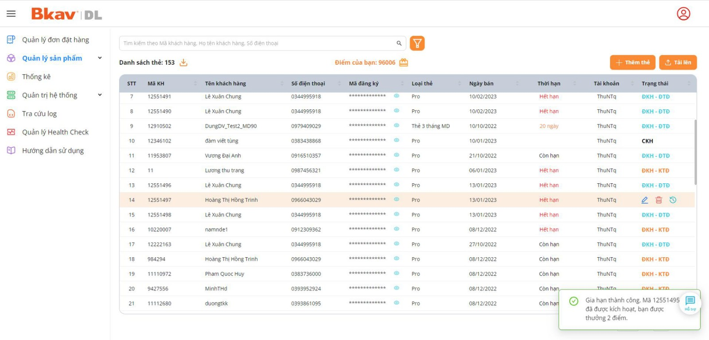
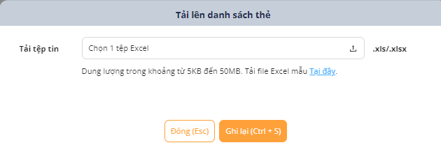

# 🆕 Thêm mới

* : Thêm mới thông tin thẻ đã cài/bán cho khách hàng:

<figure><figcaption></figcaption></figure>

1. Nhập đầy đủ **Mã KH, Số điện thoại** và các thông tin khác (Nếu có).
2. Bấm **Thêm mới** hoặc **Thêm mới và tiếp tục** để nhập tiếp thẻ mới. Bấm **Đóng** cửa sổ thêm mới đóng và không lưu thông tin vừa nhập.

Trong Danh sách thẻ: Có thể sắp xếp danh sách thẻ theo tiêu đề các cột hoặc Sửa thông tin thẻ, Xóa thẻ, xem Lịch sử, Và Gia hạn thẻ.&#x20;

<figure><figcaption></figcaption></figure>

Gia hạn thẻ:

* **Bước 1:** Chọn thẻ cần gia hạn

<figure><figcaption></figcaption></figure>

* **Bước 2:**  Nhập thông tin mã thẻ mới => Chọn **Ghi Lại** hoăc **Ghi lại và thêm tiếp**

<figure><figcaption></figcaption></figure>

* **Bước 3:** Gia hạn thành công, Hệ thống gửi một thông báo phía góc dưới bên phải màn hình.

<figure><figcaption></figcaption></figure>

Tải lên &#x20;

* Tải danh sách thông tin các khách hàng đã và đang sử dụng thẻ Bkav Pro để chủ động cho việc quản lý, theo dõi và gia hạn.
* Tải danh sách các thẻ Bkav Pro chưa sử dụng để chủ động cho việc theo dõi và bán thẻ cho khách khi có nhu cầu.

<figure><figcaption></figcaption></figure>
