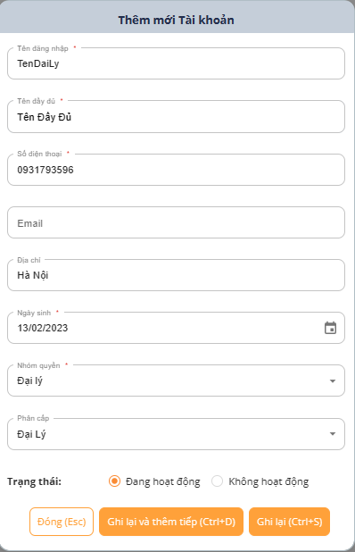
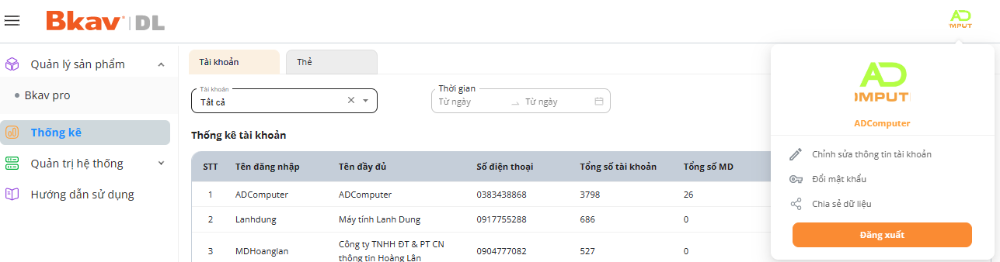
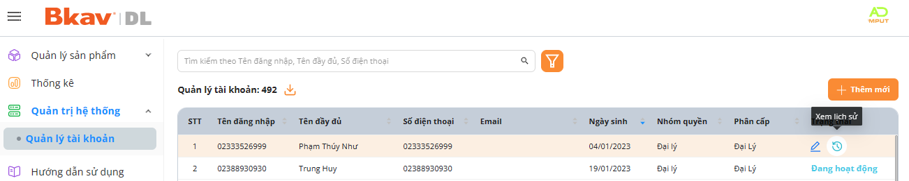

# 🆕 Thêm mới

*  Thêm mới Đại lý cấp dưới hoặc Kỹ thuật viên (Tài khoản có nhóm quyền Đại lý mới có chức năng này)

<figure><figcaption></figcaption></figure>

1. Nhập/Chọn đầy đủ thông tin ở các trường: **Tên đăng nhập, Tên đầy đủ, Số điện thoại, Email, Địa Chỉ, Ngày sinh, Nhóm quyền, Nhóm Phân Cấp** _( Nhóm quyền và Nhóm phân cấp để giữ liệu trùng nhau_ )
2. Bấm **Ghi Lại** hoặc **Ghi lại và tiếp tục** để nhập tiếp tài khoản mới. Bấm **Đóng** cửa sổ thêm mới đóng và không lưu thông tin vừa nhập.

* Bạn có thể thay đổi ảnh đại diện ở **Chỉnh sửa thông tin tài khoản** hoặc **Đổi mật khẩu** , **Chia sẻ dữ liệu** và **Đăng xuất** hệ thống tại đây:

<figure><figcaption></figcaption></figure>

* **Trong danh sách tài khoản:** Có thể sắp xếp danh sách tài khoản theo tiêu đề cột hoặc bạn có thể **Sửa** thông tin tài khoản, xem **Lịch sử** liên quan đến tài khoản.

<figure><figcaption></figcaption></figure>
